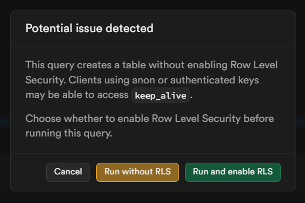
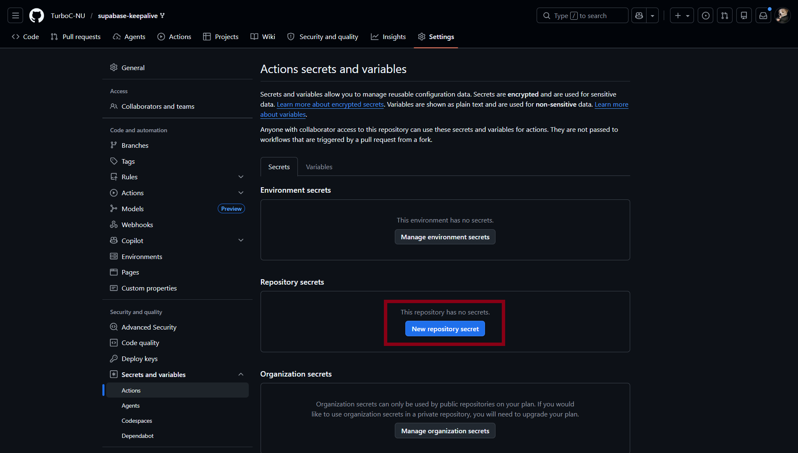
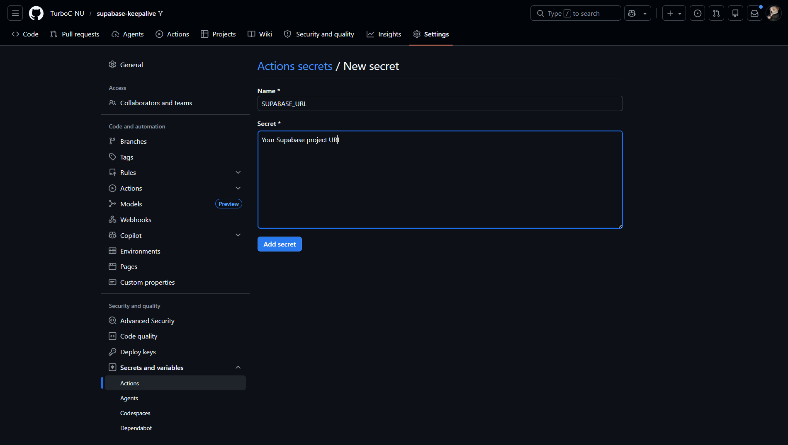
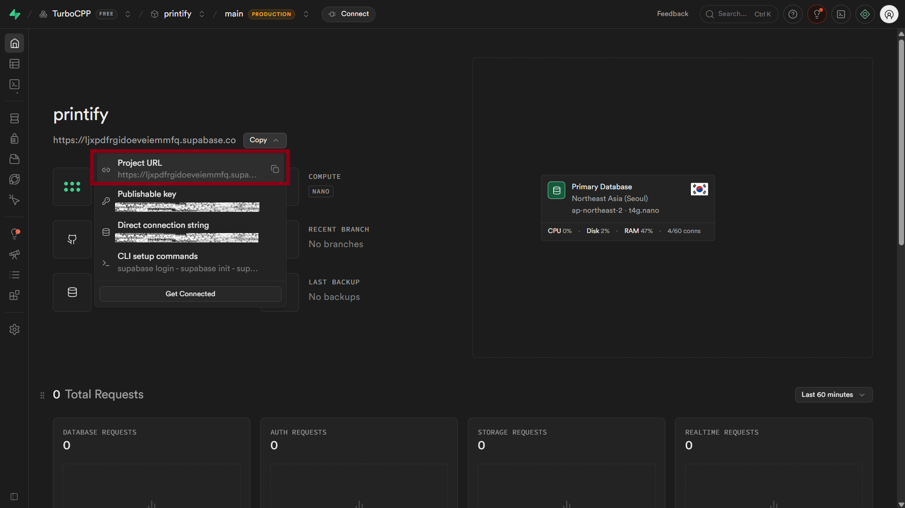
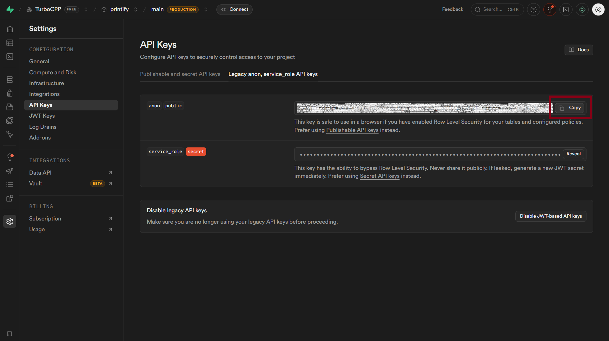
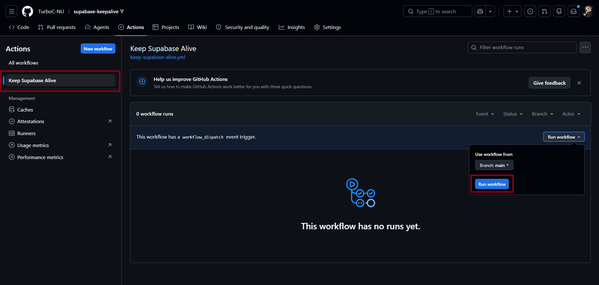
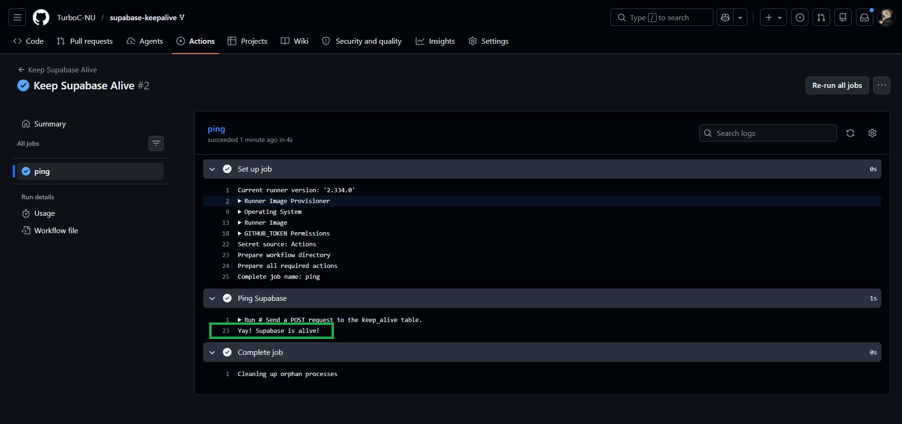

# Tutorial

> Keep your Supabase free tier project alive using GitHub Actions.
> **This will take less than 10 minutes.**

---

## What's the problem?

Supabase pauses free projects after **7 days of no database activity.**
Not 7 days without visiting the dashboard. Not 7 days without opening the app.
But 7 days without an actual query hitting your database.

This tutorial sets up an automated GitHub Action that inserts a tiny row into your database every few days — resetting the timer silently in the background.

---

## Prerequisites

- A [Supabase](https://supabase.com/) project
- A [GitHub](https://github.com/) account

---

## Step 1: Fork this repo

Click → [Fork supabase-keepalive](https://github.com/tanmay-mevada/supabase-keepalive/fork) → Hit **Create fork**

The workflow file is already inside. Nothing to write.

---

## Step 2: Create the table in Supabase

Go to your Supabase project → **SQL Editor** → run this:

```sql
CREATE TABLE IF NOT EXISTS keep_alive (
  id SERIAL PRIMARY KEY,
  pinged_at TIMESTAMPTZ DEFAULT NOW()
);
ALTER TABLE keep_alive DISABLE ROW LEVEL SECURITY;
```

You can also find this in [`setup.sql`](../setup.sql) in the root of this repo.

If you see a warning about RLS — hit **Run Without RLS**.
Safe to ignore — this table only stores timestamps, nothing sensitive.



---

## Step 3: Add GitHub Secrets

Go to your forked repo → **Settings → Secrets and variables → Actions → New repository secret**
  


Add these two secrets:

| Secret Name | Value |
|---|---|
| `SUPABASE_URL` | Your Supabase project URL |
| `SUPABASE_ANON_KEY` | Your anon / public key |



**Where to find them:**

Go to your Supabase project → **Dashboard home**
Copy the `Project URL` → paste as `SUPABASE_URL`



Go to your Supabase project → **Settings → API**
Copy the `anon / public` key → paste as `SUPABASE_ANON_KEY`



---

## Step 4: Test it

Go to your forked repo → **Actions** tab → **Keep Supabase Alive** → **Run workflow**

> If GitHub asks for permissions to enable Actions — allow it first.



You should see a green checkmark. Click on `ping` to see the success message.



To double check — go to your Supabase project → **Table Editor** → open the `keep_alive` table. There should be a new row with today's timestamp.

---

## Done

GitHub will now ping your database every **Monday and Thursday** automatically.
No maintenance needed. Your project stays alive.

---

If you run into any issues, [open an issue](https://github.com/tanmay-mevada/supabase-keepalive/issues) and I'll help you out.

*— Tanmay Mevada · [Portfolio](https://tanmaymevada.vercel.app/) · [GitHub](https://github.com/tanmay-mevada/) · [tanmaymevada24@gmail.com](mailto:tanmaymevada24@gmail.com)*
